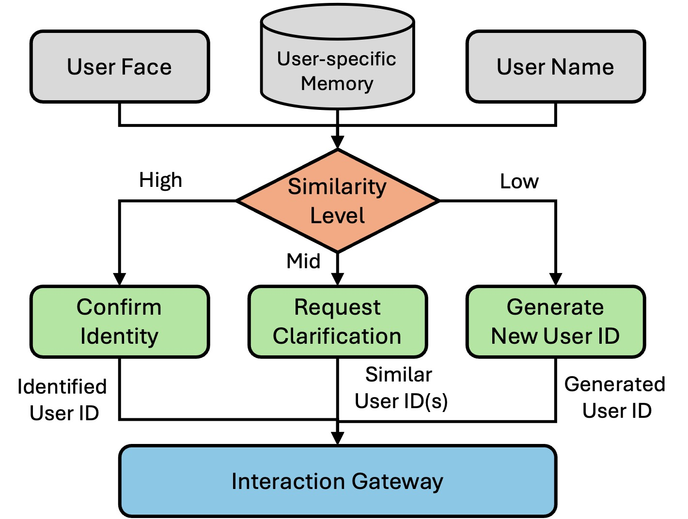

# Interaction Layer – Agents & Graph

This page documents the **multi-agent graph** that powers Nadine’s dialogue, how each agent behaves, and how they are wired together using [LangGraph](https://docs.langchain.com/oss/python/langgraph/overview).

---

## Overview of the Agent Graph (`graph.py`)

The core of the interaction layer is a LangGraph `StateGraph` defined in `nadine/agents/graph.py`.

Key components:

- **CustomState** (`state_schema.py`):
  - Holds:
    - `messages` (chat history), `intent`, `language`
    - `user_info` (ID, name, profile), `name_confirmation`, `name_checked`
    - `affect` (personality, emotion, mood, params)
    - `conversation_memory`, `episode_memory`, `visual_memory`
    - `search_results`, `vision_results`, `knowledge_retrieval`
    - `assistant_note` (memory update status text)
    - `plan_steps` (orchestrator plan)
    - `final_message` (response text)
    - `first_greeting_done`, `greeted_user_id` (greeting bookkeeping)

- **Top-level nodes** (node name, followed by the function that implements it):
  - `intention_classifier` (`classify_intent`)
  - `memory_update_agent` (`update_memory`) and `memory_retrieve_agent` (`retrieve_memory`): ChromaDB-backed textual memory plus CLIP-backed visual memory
  - `affective_appraisal` (`affective_appraisal`) and `affective_update` (`affective_update`)
  - `orchestrator` (`orchestrate`)
  - Tool agents: `search_agent` (`get_search_results`), `vision_agent` (`get_vision_results`), `knowledge_rag_agent` (`get_knowledge_retrieval`)
  - `response_agent` (`get_final_response`)

- **Execution entry**:
  - `build_agent_graph()` returns a compiled workflow used by `DialogueManager`.

---

## Intent Classifier

**Function**: `classify_intent(state: CustomState) -> CustomState`

Responsibilities:

- Reads the latest user message from `state["messages"][-1].content`.  
- Uses a **fine-tuned** LLM (via `load_agent_llm("intention_classifier")`, the `nadine-intent_classifier` Ollama model) to classify the message into one of:
  - `first_greeting`
  - `update_user_info`
  - `end_conversation`
  - `language_change`
  - `continue_conversation`

Special behavior:

- If `language_change` is detected, tries to infer the requested language from the message content, updates `state["language"]` and the persisted runtime language, then collapses intent back to `continue_conversation`.
- If `state["name_confirmation"]` contains `similar_names` and `name_checked` is `False`, forces `intent = "update_user_info"` so memory update logic can resolve the name.

### Post-classification overrides

After the model's label is validated, deterministic rules correct the cases the classifier gets wrong most often:

- `first_greeting` becomes `update_user_info` when the message contains a name introduction ("I'm Alex", "my name is", "call me"), so the memory update agent can extract the name. If no real name is found the agent stores nothing, so false positives are harmless.
- `update_user_info` becomes `continue_conversation` when the message is a question about Nadine ("tell me about yourself", "who are you").
- `end_conversation` becomes `continue_conversation` unless the message contains an explicit farewell word ("bye", "see you", "have to go now"), so future plans such as "I'm going to Paris" do not end the conversation.
- `first_greeting` is only accepted once per user: `first_greeting_done` and `greeted_user_id` are set the first time, and a repeated greeting from the same user is downgraded to `continue_conversation`. When no user ID is known, greetings are never suppressed.

Graph wiring:

- From `START` → `intention_classifier`.  
- Conditional edges:
  - To `memory_update_agent` if `intent == "update_user_info"`.
  - Otherwise to `memory_retrieve_agent`.

---

## Memory Retrieval & Update Agents

### Memory Retrieval (`memory_retrieve_agent`)

**Function**: `retrieve_memory(state: CustomState) -> CustomState`

- If memory agents are disabled (`NADINE_ENABLE_MEMORY_AGENTS=0`), logs and returns immediately.  
- Retrieval only runs for a known user: if `user_info.user_name` is missing or `"Unknown"`, the node returns the state unchanged.  
- Otherwise:
  - Calls `get_user_specific_memory(state)` from `memory_retrieval_agent.py`:
    - Loads user profile from disk (`user_info.json`).
    - Queries ChromaDB for:
      - Best matching **episode** memory (events).
      - Best matching **conversation** memory (past exchanges).
    - Queries **visual memory** (memorable scenes) using CLIP similarity.
  - Updates:
    - `state["user_info"]`
    - `state["conversation_memory"]`
    - `state["episode_memory"]`
    - `state["visual_memory"]`

Graph wiring:

- From `intention_classifier` or `memory_update_agent` (depending on conditions).  
- Next:
  - `affective_appraisal` → `orchestrator`.

### Memory Update (`memory_update_agent`)

**Function**: `update_memory(state: CustomState) -> CustomState`  
Wrapper around `memory_update_agent(state)` in `memory_update_agent.py`.

Behaviors:

- If memory agents are disabled, returns immediately.  
- Skips update if name confirmation is still pending.  
- Builds a `mem_state` with:
  - `messages`, `user_info`, `intent`, `name_checked`.
- Calls `memory_update_agent(mem_state)` to:
  - Extract user profile fields from conversation (name, company, location, hobbies, interests).
  - Save/update `user_info.json` and `user_ids.json`.
  - On `end_conversation`, summarize and save episodic memory to ChromaDB.
- Merges results back into `state`:
  - `user_info`, `name_checked`, `name_confirmation`, `episodic_memory` flags, etc.
- If `name_checked` and `user_info` are valid:
  - Sends name and ID to perception via:
    - `mqtt_comm.send_user_info_to_face_recognition(user_name, user_id)`

Graph wiring:

- Conditional edge from `intention_classifier`: `update_user_info` → `memory_update_agent`.  
- From `memory_update_agent`:
  - If `name_confirmation` present → `response_agent` (ask the user to confirm).  
  - If `intent == "end_conversation"` → `END`.  
  - Else → `memory_retrieve_agent` (normal flow).

### Name confirmation flow (high-level)

The name confirmation logic is split between the **memory update agent** and the **DialogueManager**:

<figure markdown="span">
  { width="400" }
</figure>

1. **User shares their name** (e.g., “My name is Alex”):  
   - The intent classifier sets `intent = "update_user_info"`.  
   - `memory_update_agent` extracts `user_name="Alex"` and compares it against names in `user_ids.json` using fuzzy matching.
2. **Four possible outcomes** from `save_user_info`:
   - **Strong match** (score ≥ `HIGH_SIMILARITY_THRESHOLD`):  
     - Immediately link to the existing profile for that user ID.  
     - Return updated `user_info` and `name_checked=True` with no `name_confirmation`.
   - **Ambiguous match** (between `LOW_SIMILARITY_THRESHOLD` and `HIGH_SIMILARITY_THRESHOLD`):  
     - Return a `name_confirmation` payload with:
       - `given_name`, `similar_names`, `similar_ids`, `similarity_scores`.  
     - The graph routes to `response_agent`, which asks the user to confirm the **top** suggested name (e.g., “Is your name Alice?”).
   - **No match** (below `LOW_SIMILARITY_THRESHOLD`):  
     - Proceed as a new user; create/update a profile with `user_name` and mark `name_checked=True`.
   - **Identity conflict**: face recognition already loaded a known user (say "Alex") but the person states a different, unmatched name ("Han").  
     - A new user ID is generated for the stated name instead of overwriting Alex's profile.
3. **User answers the confirmation question**:  
   - On the next turn, `DialogueManager.name_confirmation(user_input)` inspects `state["name_confirmation"]` and the user’s reply:
     - If the user says “yes / correct / that’s me”, the top candidate user ID is accepted and the full stored profile is loaded.  
     - If the user clearly states a different name (e.g. “No, I’m Alice Smith”), a **new profile** is created/updated for that name.  
     - If only one candidate remains and the user doesn’t explicitly confirm, the `given_name` may be taken as the new canonical name.  
     - Otherwise, the candidate list is rotated (pop the first suggestion) and another confirmation question will be asked later.
   - In every resolved case:
     - `name_checked=True`, `name_confirmation={}`.  
     - `send_user_info_to_face_recognition(user_name, user_id)` is called, so perception stores/updates face embeddings under the correct ID.

This loop ensures that:

- Faces, memories, and conversations are consistently linked to the **correct** user ID.  
- Ambiguous matches never silently overwrite existing users; they’re always confirmed explicitly in dialogue.

---

## Affective System

### Affective Appraisal

**Function**: `affective_appraisal(state: CustomState) -> CustomState`

- Ensures `state["affect"]` has subkeys:
  - `personality`, `emotion`, `mood`, `params`.
- Uses `appraise_event_with_llm(...)` from `affective_system.py` to:
  - Take the latest user message and contextual info (e.g. retrieved episode memories).  
  - Produce a new emotion label/intensity.
- Calls `update_affect_state(...)` to update PAD mood/emotion state.
- Publishes the new emotion to `nadine/affect/state` as `{"label", "arousal", "intensity"}`; the perception layer's selective memory uses it to decide whether the current scene is worth storing.

Graph wiring:

- From `memory_retrieve_agent` → `affective_appraisal` → `orchestrator`.

### Affective Update

**Function**: `affective_update(state: CustomState) -> CustomState`

- Post-response hook (after `response_agent`).  
- Currently a pass-through, but is a good place to:
  - Increment turn counters,  
  - Adjust mood based on interaction outcome, etc.

Graph wiring:

- From `response_agent` → `affective_update`.  
- Conditional edge:
  - If `intent == "end_conversation"` → `memory_update_agent` (for final episodic save).  
  - Else → `END`.

---

## Orchestrator & Sub-Agents

### Contextualizer

**Function**: `contextualizer()` (used within `orchestrate`)

- **Purpose**: Summarizes conversation history to provide context to the orchestrator without passing the full chat history (which can cause invalid JSON output with long conversations).
- **Location**: `nadine/agents/context_summarizer.py`
- **Behavior**:
  - Receives only the chat history (all messages except the latest one).
  - Asks the `contextualizer` model (`ft_episodic_memory`) to summarize the conversation in one sentence.
  - Returns "No context found" when there is nothing to summarize.
- **Usage**: Called by the orchestrator when chat history exists; the sentence is passed to the orchestration model as `context` alongside the latest user message.

### Orchestrator (`orchestrate`)

**Function**: `orchestrate(state: CustomState) -> CustomState`

- Ensures `state["plan_steps"]` is a list.  
- If a plan already exists, returns immediately.  
- **Fast path**: for `end_conversation` and `first_greeting` it leaves the plan empty, so the graph goes straight to `response_agent` without calling the contextualizer or the orchestration model.  
- Otherwise:
  - **Context Generation**: If chat history exists, calls `contextualizer()` to generate conversation context (prevents invalid JSON from long histories).
  - Builds an `orchestration_agent()` chain from `orchestration_agent.py`.  
  - Passes:
    - Latest user message.
    - Generated context (if available) - a summarized version of the conversation history.
  - Receives a JSON "plan" describing a sequence of steps, e.g.:
    - `search_agent`, `knowledge_rag_agent`, `vision_agent`, `response_agent`.
  - Stores the plan in `state["plan_steps"]`.

**Note**: The orchestrator no longer receives the full `chat_history` directly to avoid JSON parsing errors with long conversations. Instead, it receives a summarized context from the contextualizer.

Graph wiring:

- From `affective_appraisal` → `orchestrator`.  
- Conditional edges:
  - If `plan_steps` empty → `response_agent`.  
  - Else → first planned agent, e.g. `search_agent`, `vision_agent`, or `knowledge_rag_agent`.

### Tool-agent contract

The three tool agents share one contract. Each is entered from `orchestrator` when it is the first step of the plan, takes its query from `state["plan_steps"][0]["message"]`, writes its result to its own state field, and pops the executed step from `plan_steps`. The conditional edge after every tool agent is the same: if `plan_steps` is now empty, go to `response_agent`; otherwise go back to `orchestrator`, which dispatches the next planned step without re-planning.

### Search Agent (`search_agent`, `get_search_results`)

- Uses `search_agent()` to run a question-answering pipeline (web search routed by `search_router`, answer summarized by `search_answer`).  
- Result field: `state["search_results"]`.

### Vision Agent (`vision_agent`, `get_vision_results`)

- If vision agents are disabled (`NADINE_ENABLE_VISION_AGENT=0`), sets `state["vision_results"]` to a fallback string and pops the step.  
- Otherwise calls `vision_agent()` with the planned question.  
- Result field: `state["vision_results"]`.

### Knowledge RAG Agent (`knowledge_rag_agent`, `get_knowledge_retrieval`)

- Calls `get_related_knowledge(state)` from `knowledge_RAG_agent.py`, which builds or loads a ChromaDB vectorstore from `interaction/db/knowledge/rag_files/`, embeds sections with `OllamaEmbeddings`, retrieves the most relevant chunk for the current question, and optionally displays a related visual in the UI.  
- Result field: `state["knowledge_retrieval"]`.

---

## Response Agent

**Function**: `get_final_response(state: CustomState) -> CustomState`

Wrapper around `response_agent()` from `response_agent.py`:

- If `state["name_confirmation"]` contains `similar_names`, returns early to trigger a name-confirmation prompt.  
- Otherwise:
  - Clears `plan_steps`.  
  - Calls `response_agent()(state)`:
    - Builds a composite user packet with:
      - Search, vision, knowledge results.
      - Current time/date.
      - Affective state (emotion + mood text).
      - Optional visual memory: the stored scene image (encoded as a data URL) plus a "VISUAL MEMORY" text block carrying the scene description generated by perception.
    - Sends a system prompt describing Nadine’s persona and language rules, including a recall rule: when the user asks whether Nadine remembers them or a previous meeting, the model weaves specific visual details from the attached scene into the reply as a memory of its own, without saying that it sees an image.
    - Invokes the configured `response_llm`.
    - Returns the final message text.
  - Writes the response into `state["final_message"]`.  
  - Resets:
    - `conversation_memory`, `episode_memory`,
    - `search_results`, `vision_results`, `knowledge_retrieval`.

Graph wiring:

- Called from many points:
  - Directly after `orchestrator` if no tools are needed.  
  - After tool agents if `plan_steps` is empty.  
  - From `memory_update_agent` when name confirmation is required.  
- After `response_agent`, the graph always goes to `affective_update`.

---

## Testing & Test Harnesses

All agents include comprehensive test harnesses that can be run directly:

- **Intent Classifier**: `python intention_classifier_test.py` - Tests intent classification with various message types.
- **Memory Update Agent**: `python memory_update_agent.py` - Tests user info extraction and episodic memory summarization.
- **Orchestration Agent**: `python orchestration_agent.py` - Tests routing to different sub-agents.
- **Search Agent**: `python search_agent.py` - Tests search router and answer summarization.
- **Vision Agent**: `python vision_agent.py` - Tests vision router and image description (with real images from `db/nadine_view/samples/`).
- **Response Agent**: `python response_agent.py` - Tests response generation with various affect states and contexts.
- **Contextualizer**: `python context_summarizer.py` - Tests conversation context summarization.

**Centralized Test Samples**: All test cases are stored in `agent_test_samples.py` for easy maintenance and reuse:
- `INTENT_CLASSIFICATION_TEST_MESSAGES`
- `USER_INFO_TEST_MESSAGES`
- `EPISODIC_MEMORY_TEST_CONVERSATIONS`
- `ORCHESTRATION_TEST_CASES`
- `SEARCH_ROUTER_TEST_CASES`
- `SEARCH_ANSWER_TEST_CASES`
- `VISION_ROUTER_TEST_CASES`
- `VISION_DESCRIPTION_TEST_CASES`
- `VISION_REAL_IMAGE_QUESTIONS`
- `RESPONSE_AGENT_TEST_CASES`
- `CONTEXTUALIZER_TEST_CASES`

## Putting It All Together

For each user input, the graph runs roughly:

1. `intention_classifier` → classify the message.  
2. `memory_update_agent` (for profile updates) or `memory_retrieve_agent` (for context recall).  
3. `affective_appraisal` → update emotion/mood.  
4. `orchestrator` → decide which sub-agents (if any) to call:
   - Fast path: `first_greeting` and `end_conversation` go straight to `response_agent`.
   - **Contextualizer** (if history exists) → one-sentence summary of the history.
   - Orchestrator uses context + user message to route requests.
5. `search_agent` / `vision_agent` / `knowledge_rag_agent` (optional).  
6. `response_agent` → final reply.  
7. `affective_update` → finalize affect and optionally trigger further memory updates.

Detailed memory mechanics are documented on the **Interaction Layer / Memory & RAG** page.

