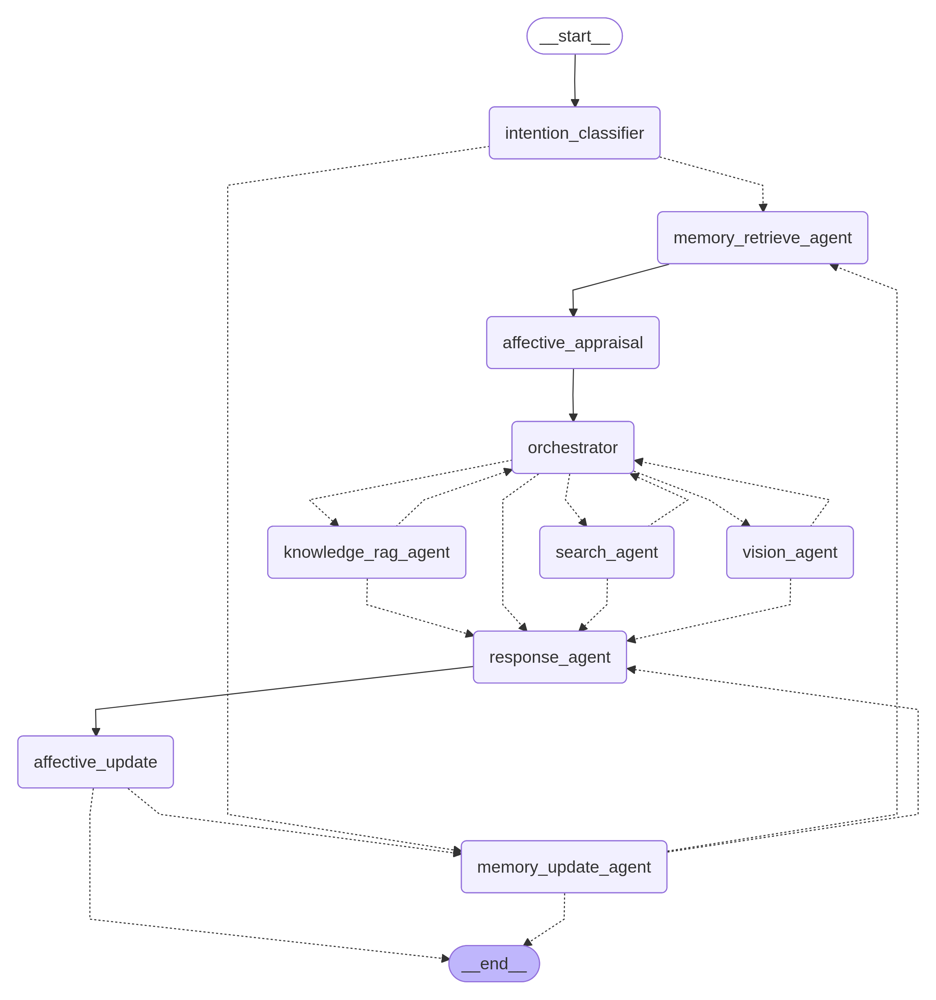
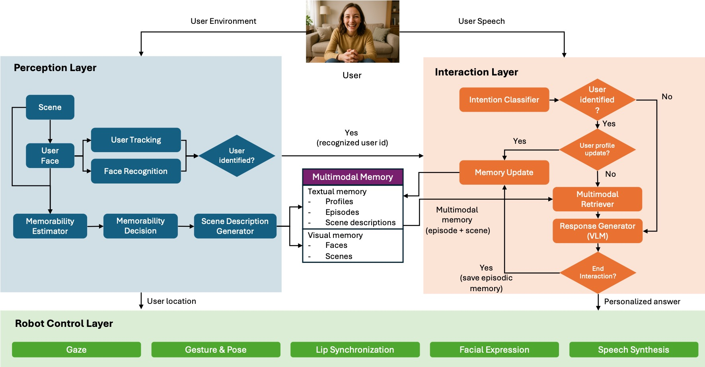

# Project Overview – Architecture & Features

This page gives a high-level view of Nadine’s architecture and major features.

---

## System Architecture

Nadine is organized into three main components that communicate via MQTT:

### 1. Control Component (`control/`)

Handles robot physical control, animations, and speech synthesis:

- Robot joint control and animations (XML-based).  
- Azure Text-to-Speech (TTS) integration.  
- Serial communication with robot hardware.  
- Head/eye movement control (look-at functionality).  
- Lip-sync animation generation.  

### 2. Interaction Component (`interaction/`)

Multi-agent dialogue system built with [LangGraph](https://docs.langchain.com/oss/python/langgraph/overview):

- **Orchestration Agent** – routes requests to the right sub-agents.  
- **Response Agent** – generates conversational responses with emotional tone.  
- **Search Agent** – real-time web information retrieval.  
- **Knowledge RAG Agent** – retrieves information from Nadine’s knowledge base.  
- **Vision Agent** – interfaces with visual reasoning tools.  
- **Memory Agents** – store and retrieve user-specific information.  
- **Affective System** – maintains emotional state (PAD model).  
- **Dialogue Manager** – coordinates conversation flow.  
- Speech-to-Text (Google Cloud Speech).  
- Multi-language support (English, German, French, Chinese).  
- UI for monitoring.  

### 3. Perception Component (`perception/`)

Computer vision and face recognition:

- RealSense camera integration (RGB + depth).  
- Face detection using YOLOv8.  
- Face recognition using InsightFace.  
- 3D position tracking for look-at control.  
- User profile management with face embeddings.  

---

## System Workflow

The following diagram summarizes how components and agents interact:



At a high level:

1. Perception detects and recognizes users, publishes identity and 3D position.  
2. Interaction receives user speech and visual context, runs the multi-agent graph.  
3. Control executes speech and animations based on interaction commands.  

See the dedicated **Perception**, **Interaction**, and **Control** layer docs for details.

---

## Project Structure

Simplified directory layout:

```text
nadine_Jan_2026/
├── control/                 # Robot control and animations
│   ├── main.py             # Control server entry point
│   ├── nadine/control/    # Control modules
│   └── XMLAnimations/      # Animation XML files
│
├── interaction/            # Multi-agent dialogue system
│   ├── nadine/agents/     # LangGraph agents
│   ├── nadine/common/     # MQTT, translation, logging
│   ├── nadine/stt/        # Speech-to-text
│   └── db/                # Databases (memory, knowledge, images)
│
├── perception/            # Computer vision
│   ├── main.py            # Face recognition main loop
│   └── models/            # ML models
│
├── compose.yaml           # Docker Compose for MQTT
└── start_nadine.sh        # Main startup script
```

---

## Key Features

### Multi-Agent System (Interaction Layer)

The interaction component uses LangGraph to orchestrate multiple specialized agents:

- **Orchestration** – decides which agents to call.  
- **Search** – real-time web information retrieval.  
- **Knowledge RAG** – access to Nadine’s internal knowledge base.  
- **Vision** – image understanding and scene analysis.  
- **Memory** – persistent user profile and episodic memory management.  
- **Response** – context-aware, emotionally intelligent replies.  

### Face Recognition & Gaze (Perception + Control)

- Real-time face detection and tracking.  
- User identification with confidence scoring.  
- Automatic face storage for new users.  
- 3D position tracking to drive natural gaze and head movements.  

### Multi-Language Support

- Automatic language detection and translation.  
- Language-specific TTS voices.  
- Currently supports: English, German, French, Chinese (with flexibility to extend).  

### Memory System

- User profile management (`user_info.json` per user).  
- Conversation history and episodic memories stored in ChromaDB.  
- Visual memory (memorable scenes) linked to user IDs.  

### Affective System

- PAD (Pleasure–Arousal–Dominance) emotional model.  
- Emotion-aware response generation.  
- Dynamic mood and emotion updates per interaction.  

### Multimodal Memory Framework

Nadine implements a multimodal memory framework that tightly couples **perception** and **interaction**:

- **Selective visual memory (perception)**  
  - The perception layer computes a memorability score per frame using:
    - Emotion salience from OpenFace (facial expressions).  
    - Novelty from CLIP embeddings vs. past scenes for that user.  
  - Only scenes above a configurable threshold are stored under each user’s profile as:
    - RGB images, CLIP embeddings, and JSON metadata (emotions, memorability, optional scene description).  

- **Textual & episodic memory (interaction)**  
  - The interaction layer stores:
    - Conversation snippets and episodic summaries in a per-user Chroma collection.  
    - Structured user profiles in `user_info.json` and `user_ids.json`.  

- **Hybrid retrieval (interaction)**  
  - For a new user query, the memory agents:
    - Query Chroma for the most relevant **conversation** and **episode** documents.  
    - Use CLIP text embeddings to find the most relevant **visual memory** (image) for that user.  
    - Apply configurable thresholds and weights (image vs. description similarity) from `interaction/config.yaml`.  
  - The best matching visual memory (if any) is passed to the response LLM as an attached image, alongside textual memories and RAG results.

Together, this allows Nadine’s responses to be grounded in **what was seen**, **what was said**, and **who the user is**, rather than relying on text alone.



---

## Research & Applications

Nadine has been used in various research and real-world contexts:

- Customer service (AIA Singapore).  
- Elderly care and companionship.  
- Public demonstrations and conferences.  
- Human-robot interaction research.  
- AI-for-Good initiatives.  


